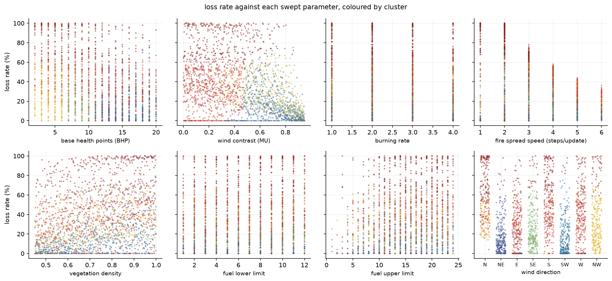
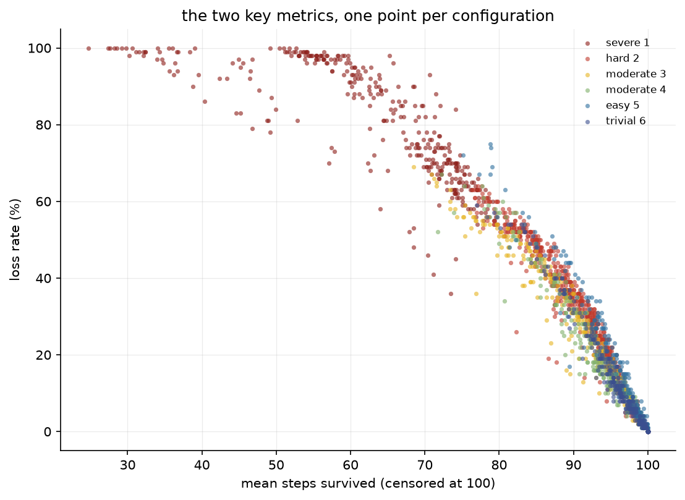
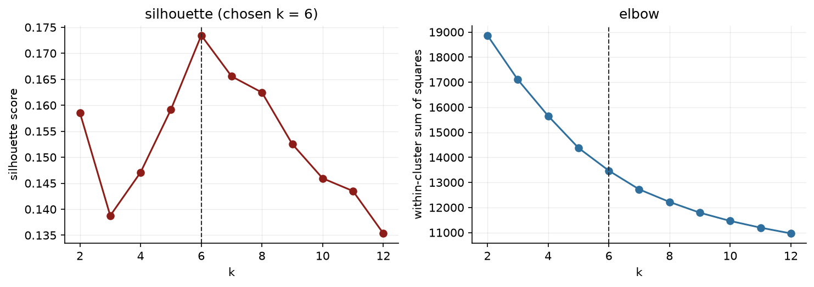
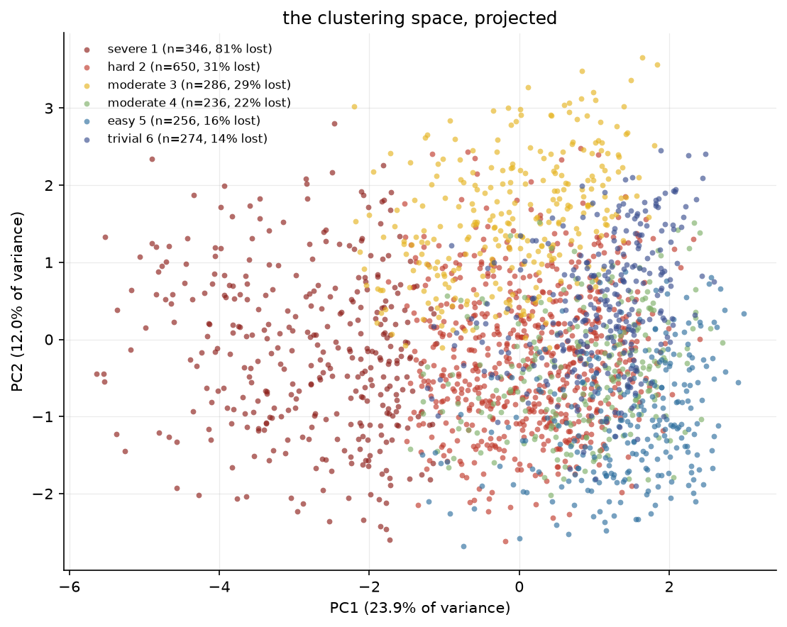
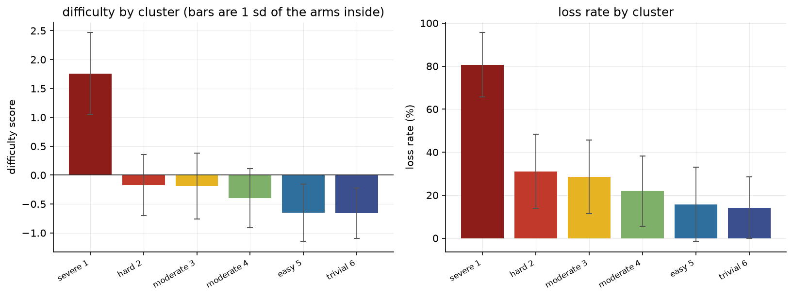
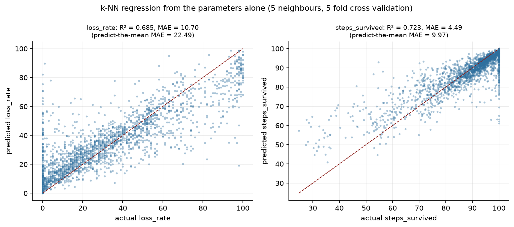

# Baseline difficulty across the wildfire parameter space

**2048 configurations of the unmanaged wildfire, 100 simulations each (204,800 runs), cluster into 6 groups of similar behaviour.** Loss rate spans 0.0% to 100.0% (median 28.0%), and the parameters predict it well enough for the grouping to mean something: k-NN regression from the eight settings alone reaches R² = 0.68 on loss rate and R² = 0.72 on mean steps survived.

Commit `bad2d972885568652d38d6ba6be84a63ea1504f3`. Design seed `20260811`, fire seed block `7000000`.

## 1. Objective

Establish which combinations of environment settings produce similar *baseline* difficulty — how hard the wildfire is with nothing defending against it — so that later UAV experiments can choose their scenarios from named regions of the parameter space rather than from the one calibrated configuration `config.py` ships with.

Two questions follow from that. Where on the difficulty surface does a given set of parameters land, and do the parameters determine the difficulty at all, or is the outcome dominated by where the fire happened to start?

## 2. Model

Zero UAVs, no managing system, and a home base for the fire to reach. A run is **lost** when the base has burned for `BHP` steps, cumulatively, and **won** by surviving 100 steps with the base standing. With no UAVs flying, no water is ever dropped, so the outcome is a property of the fire and the terrain alone.

Held fixed in every configuration:

| setting | value | why |
|---|---|---|
| `WIDTH` × `HEIGHT` | 100 × 100 | the calibrated grid |
| `BATCH_SIZE` | 100 | run length in steps; the only run length there is |
| `NUM_AGENTS` | 0 | the measurement is the fire on its own |
| `MANAGING_SYSTEM` | `none` | nothing adapts |
| `ACTIVATE_FIREFIGHTING` | `True` | required — it is the base that is lost |
| `FIRE_START_STEP` | 0 | alight before the first step |
| `FIRE_START_POSITION` | `random` | uniform over the grid, avoiding the base |
| `ACTIVATE_SMOKE` | `False` | smoke only occludes observation, and nothing observes |
| `WIND_VARIABILITY` | `None` | one direction for the whole run |
| `ACTIVATE_FUEL` | `False` | UAV tanks; no UAVs |
| `ACTIVATE_POSITION_ERROR` | `False` | UAV position noise; no UAVs |

## 3. Design

A scrambled Sobol sequence of 2048 points, not a grid. A full factorial over eight parameters at usable resolution is tens of thousands of arms, and a coarse one covers the space with a lattice that a distance-based clustering method mostly just recovers. Sobol spends the same budget on points spread evenly at every scale.

Seven dimensions come from the sequence. Wind direction is categorical and is **stratified** instead — exactly 256 configurations per compass point.

| parameter | range | `config.py` default | note |
|---|---|---|---|
| `BHP` | 2 – 20 | 4 | steps the base survives burning for |
| `MU` | 0.0 – 0.95 | 0.9 | downwind contrast, **not** wind speed; 0 is a still day |
| `BURNING_RATE` | 1 – 4 | 1 | fuel lost per fire update; larger burns out sooner |
| `FIRE_SPREAD_SPEED` | 1 – 6 | 1 | steps *between* fire updates, so larger is **slower** |
| `DENSITY_PROB` | 0.45 – 1.0 | 0.9 | vegetation density |
| `FUEL_BOTTOM_LIMIT` | 1 – 12 | 5 | per-cell fuel floor |
| `FUEL_UPPER_LIMIT` | bottom – 24 | 10 | drawn from the bottom limit up, so `bottom ≤ upper` holds by construction |
| `WIND_DIRECTION` | 8 compass points | `['NORTH', 'SOUTH']` | stratified, 256 arms each |

The ranges deliberately reach past the shipped defaults on the *easy* side. The zero-UAV baseline at those defaults lost 100% of 5000 runs, so a design centred on them would have measured nothing but the ceiling.

## 4. Method

Each configuration ran 100 simulations. Run *i* of **every** configuration uses seed `7000000 + i`, so the configurations are paired on the fire: they see the same ignitions, and the difference between two of them is not partly the difference between two sets of fires.

Two outcome metrics, because steps-to-loss is censored:

- **loss rate** — the share of runs lost, with a 95% Wilson interval.
- **steps to loss** — mean over the lost runs only, with a 95% *t* interval. Undefined for a configuration that never loses.
- **steps survived** — mean over every run, a survivor contributing 100. Defined everywhere, so this is the one that enters the clustering.

Clustering is **K-means** over the 11 standardised dimensions — the eight parameters and the two outcome metrics — with *k* chosen by silhouette score over 2–12. k-NN has no clustering form; it is a supervised method, and there are no labels here. It comes back in the role it can fill, as the validation in §7.

Wind direction enters the feature space as `MU` times the unit heading vector, not as the heading alone. At `MU = 0` the direction has no physical effect, so a raw encoding would place a still northerly far from a still southerly and invent a distinction the simulation does not make.

## 5. Results: the difficulty surface

| metric | min | p25 | median | p75 | max |
|---|---|---|---|---|---|
| loss rate (%) | 0.0 | 11.0 | 28.0 | 51.0 | 100.0 |
| steps to loss | 16.0 | 60.7 | 67.0 | 71.6 | 100.0 |
| steps survived | 24.7 | 82.7 | 91.8 | 96.3 | 100.0 |

The design spans the whole range rather than piling up at one end: 17 configurations (0.8%) lost every run and 167 (8.2%) lost none. Those 167 with no losses have no steps-to-loss at all, which is the censoring §8 returns to.

At 100 runs each, a single configuration's loss rate carries a 95% Wilson interval of about ± 7.1 points. That is the resolution of one point on the surface; the clusters below average over many.





### Wind direction

| direction | configurations | mean loss rate |
|---|---|---|
| north | 256 | 56.7% |
| south | 256 | 49.8% |
| west | 256 | 39.1% |
| north west | 256 | 35.2% |
| south east | 256 | 27.3% |
| east | 256 | 27.0% |
| south west | 256 | 18.2% |
| north east | 256 | 17.5% |

Direction matters more than any single other setting's marginal: north loses 56.7% of its runs against 17.5% for north east, a factor of 3.2. Each figure averages 256 configurations spread over the whole of the rest of the space, so this is the effect of direction alone.

The split is **cardinal against diagonal**, not toward-the-base against away-from-it: the four cardinal directions average 43.2% and the four diagonals 24.5%. That ordering is not explained by the home base sitting a quarter into the grid — the mean ignition cell of a lost run sits closer to the base than the grid mean under *every* direction, cardinal or not. **This experiment establishes the pattern and does not explain it.** A mechanism would have to come from how `fire_spread.on_wind()` picks upwind neighbours out of a Moore neighbourhood, and testing that needs its own experiment.

## 6. The clusters

Silhouette selected **k = 6** (score 0.173). Both selection curves are drawn, because there is no true number of clusters here and the choice should be visible rather than asserted.





Difficulty is `0.5 * z(loss_rate) + 0.5 * z(-steps_survived)` — losing often and losing fast both count as hard, weighted equally. **The equal weighting is a stated convention, not something the data derives.**

| rank | label | arms | difficulty (95% CI) | loss rate | steps survived | steps to loss |
|---|---|---|---|---|---|---|
| 1 | **severe 1** | 346 | +1.76 (+1.68 to +1.83) | 80.6% (36–100) | 62.7 | 54.4 |
| 2 | **hard 2** | 650 | -0.17 (-0.21 to -0.13) | 31.1% (0–64) | 90.4 | 69.2 |
| 3 | **moderate 3** | 286 | -0.19 (-0.26 to -0.13) | 28.5% (0–69) | 89.8 | 65.0 |
| 4 | **moderate 4** | 236 | -0.40 (-0.47 to -0.33) | 22.0% (0–67) | 92.1 | 63.3 |
| 5 | **easy 5** | 256 | -0.65 (-0.71 to -0.59) | 15.8% (0–75) | 95.8 | 73.8 |
| 6 | **trivial 6** | 274 | -0.66 (-0.71 to -0.61) | 14.1% (0–59) | 95.3 | 64.8 |

**The ranking is not uniformly a difficulty ranking.** Ranks **2** and **3**, **5** and **6** have overlapping 95% intervals on their mean difficulty: those clusters are separated by their *parameters*, not by how hard they are. Different combinations of settings arrive at the same difficulty, which is the more useful finding — it means a scenario of a given difficulty can be reached several ways, and the clusters say which.

What each cluster is, in the settings a reader would type into `config.py`:

| rank | label | BHP | MU | burn rate | spread speed | density | fuel | wind |
|---|---|---|---|---|---|---|---|---|
| 1 | **severe 1** | 8.0 | 0.31 | 2.2 | 2.1 | 0.77 | 7.0–16.6 | north (34%) |
| 2 | **hard 2** | 12.6 | 0.22 | 2.6 | 4.0 | 0.71 | 6.3–14.8 | east (32%) |
| 3 | **moderate 3** | 4.2 | 0.64 | 2.5 | 4.0 | 0.71 | 6.5–15.2 | north west (76%) |
| 4 | **moderate 4** | 8.8 | 0.72 | 2.5 | 3.7 | 0.72 | 6.5–14.9 | south east (98%) |
| 5 | **easy 5** | 17.7 | 0.71 | 2.5 | 3.5 | 0.72 | 6.4–15.1 | south west (97%) |
| 6 | **trivial 6** | 13.8 | 0.69 | 2.6 | 3.5 | 0.72 | 6.4–15.1 | north east (90%) |

Values are cluster means, so they describe the region rather than naming a member of it. A cluster whose wind column reads *even* is one the wind direction did not help define.



The hardest region, **severe 1**, loses 80.6% of its runs and survives 62.7 of 100 steps on average. The easiest, **trivial 6**, loses 14.1% and survives 95.3.

## 7. Do the parameters predict the outcome?

K-means will partition a formless cloud as readily as a structured one, so the clusters are worth nothing on their own. The check is k-NN regression from the **parameters alone** — the outcome metrics held out — to each metric, 5 neighbours, 5-fold cross validation, with scaling fitted inside each fold so no test data leaks into it.

| target | R² | MAE | predict-the-mean MAE | sd |
|---|---|---|---|---|
| loss_rate | 0.685 | 10.70 | 22.49 | 27.45 |
| steps_survived | 0.723 | 4.49 | 9.97 | 13.50 |

The parameters carry a clear majority of the outcome, with the remainder going to the ignition position and the run-to-run variance of the fire itself. The clusters describe real structure, and individual configurations inside one still vary.



## 8. Validity

**Steps survived is censored, not a survival time.** A run that never loses contributes 100, so at the easy end the metric saturates and stops distinguishing a configuration the fire never threatens from one it nearly reaches. Loss rate carries that end of the surface; steps survived carries the hard end. Neither alone is the difficulty.

**All 2048 configurations share 100 ignitions.** Pairing on the seed is what makes two configurations comparable — it removes ignition position from the difference between them — but it means every configuration's *absolute* loss rate carries the same fire-sample error. Relative comparisons are much tighter than the absolute numbers.

**The difficulty score is a convention.** Equal weight on loss rate and on survival time is asserted here, not derived. A reader who weights them differently will get a different ranking from the same clusters; the per-arm scores are in `clusters.csv` to make that cheap.

**Standardising asserts something too.** Giving one standard deviation of density the same weight as one of fuel is a choice about what 'similar' means. Every alternative is also a choice; this one at least does not depend on the units the settings happen to use.

**k is not a fact about the data.** Silhouette peaked at 6, but the curve in §6 is shallow across much of its range, which is what a continuous surface looks like when it is cut into pieces. The clusters are a useful summary of that surface, not seams in it.

## 9. What was not run

- **Anything with UAVs.** This is the baseline the adaptation experiments are measured against, not a measurement of any policy.
- **`BATCH_SIZE`.** Held at 100 throughout. It is the strongest difficulty dial there is, which is exactly why sweeping it alongside the others would have swamped them.
- **Grid size.** Held at 100 × 100, so nothing here says how the clusters move with it.
- **`WIND_VARIABILITY`.** Every run holds one direction. A wind that redraws mid-run is a different model and would need its own axis.
- **Smoke.** Switched off. It only occludes observation, and nothing observes.

## 10. Reproducing

```bash
python3 -m pip install -r requirements.txt
python3 experiments/20260811_paramspace/design.py       # design.json, deterministic
python3 experiments/20260811_paramspace/dump_config.py  # config-used.json
python3 experiments/20260811_paramspace/run.py --workers 10   # hours
python3 experiments/20260811_paramspace/analyse.py      # arms.csv, summary.json
python3 experiments/20260811_paramspace/cluster.py      # clusters.csv, cluster-summary.json
python3 experiments/20260811_paramspace/figures.py      # figures/*.png
python3 experiments/20260811_paramspace/report.py       # this file, and the PDF
```

`run.py` checkpoints per configuration and resumes, so it can be interrupted. Set the run length through `BATCH_SIZE` in `design.py`, never through a step count — the model stops itself at its own `BATCH_SIZE`, and a loop bound below it scores a truncated run as won.
